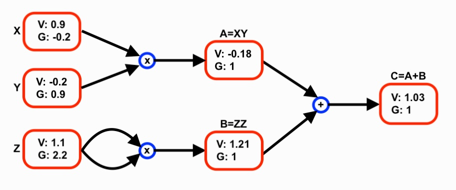

# AutoGrad
A tiny automatic differentiation engine written in C.

This project implements a computational graph with reusable nodes for performing:
- Forward propagation
- Reverse-mode automatic differentiation (backpropagation)
- Topological sorting given a final node
- Gradient descent with given learning rate, and topological sorted list
Currently supported operations:
- Addition (+)
- Subtraction (-)
- Multiplication (*)
- Sum (Σ)
---
## Build
Compile with:
```bash
gcc main.c autoGrad.c -o output
```
Run:
```bash
./output
```

---
## Core Idea
Unlike the previous autograd implementation in [CMNIST](https://github.com/Beginner10617/CMNIST.git) that dynamically create new graph nodes during every forward pass, this engine required building the graph only once beforehand. 

After construction, the same graph can be reused for:
- Multiple forward passes
- Multiple backward passes
- Changing input values without reallocating nodes

This makes the computation graph behave more like a static graph framework.

---
## Example
A simple toy example of the following computation graph (shown below) is in `main.c` and the output is mathematically correct
<div align="center">

</div>

---
## Forward Pass
Each node stores:
- It's current value
- References to previous nodes
- The operation used to compute it

Calling `node->_forward(node);` computes the node's value using its dependencies.

Forward execution order should follow a topological ordering of the graph.

To achieve this, a `ValueList` will be computed using `topoSortList()` once the graph is constructed.

The list can then be used in a learning loop calling `forward()`, `backward()` and `gradientDescent()`
in that order. Unlike the previous implementation, no new memory will be allocated in these calls.

---
## Backward Pass
Gradients are propagated using reverse-mode autodiff.

To start backpropagation, first set the output node `C->grad = 1;`

Then call backward functions in reverse topological order:
```
C->_backward(C);
B->_backward(B);
A->_backward(A);
...
```
Each operation accumulates gradients into its parent nodes.

---
## Design
Each `Value` node contains:
- scalar `data`
- gradient (`grad`)
- pointers to previous nodes (`_prev`)
- forward function pointer (`_forward`)
- backward function pointer (`_backward`)

The graph is manually constructed using helper functions like `setAdd(out, x, y)`

---
## Possible Improvements
- More operations : exponential functions, activation functions like `tanh`, `ReLU`, etc.
- Implementing neural network layers
- Testing neural network over MNIST dataset

---
## Inspiration
While building a [digit classifier in C](https://github.com/Beginner10617/CMNIST.git) with a custom autograd engine, I noticed frequent memory allocation/deallocation caused by rebuilding the computation graph every pass. This project explores a reusable graph design to avoid those redundant allocations. 
