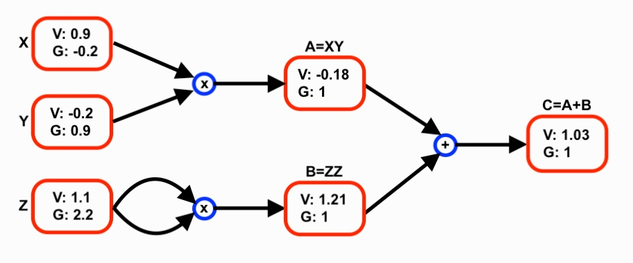

# AutoGrad

A tiny **single-header automatic differentiation engine** written in C.

AutoGrad implements a reusable **static computation graph** supporting:

* Forward propagation
* Reverse-mode automatic differentiation (backpropagation)
* Topological sorting of computation graphs
* Gradient descent using a precomputed topological ordering

Currently supported operations:

* Addition (`+`)
* Subtraction (`-`)
* Multiplication (`*`)
* Summation (`Σ`)
* Hyperbolic tangent (`tanh`)

The library also includes basic neural network building blocks:

* `Neuron`
* `Layer`
* `MLP` (Multi-Layer Perceptron)

These components are implemented but are still undergoing testing.

---

## Features

* Single-header library
* Static computation graph (build once, reuse indefinitely)
* No graph reconstruction between iterations
* Forward and backward propagation
* Topological graph traversal
* Simple neural network primitives
* Minimal dependencies (standard C)

---

## Getting Started

Include the header normally wherever the API is needed:

```c
#include "autograd.h"
```

In **exactly one** source file, define the implementation macro before including the header:

```c
#define AUTOGRAD_IMPLEMENTATION
#include "autograd.h"
```

Compile your program as usual:

```bash
gcc main.c -o output
```

Run:

```bash
./output
```

---

## Core Idea

Unlike the previous autograd implementation in
[CMNIST](https://github.com/Beginner10617/CMNIST.git),
which rebuilt the computation graph during every forward pass, this engine constructs the graph only once.

After construction, the same graph can be reused for:

* Multiple forward passes
* Multiple backward passes
* Gradient descent updates
* Updating input values without reallocating graph nodes

This design is similar to a **static computation graph**, where graph construction and graph execution are separate stages.

---

## Example

A simple computation graph demonstrating the library is implemented in `main.c`.

The computed outputs and gradients have been verified against the expected mathematical values.

<div align="center">

</div>

---

## Forward Pass

Each `Value` node stores:

* Current scalar value
* Gradient
* References to parent nodes
* The operation used to compute the value

Calling

```c
node->_forward(node);
```

computes the node using the values of its dependencies.

Forward execution should follow a topological ordering of the graph.

This ordering only needs to be computed once after graph construction:

```c
ValueList topo;
topoSortList(output, &topo);
```

The resulting ordering can then be reused throughout training:

```text
forward()
backward()
gradientDescent()
```

No additional graph allocation occurs during these iterations.

---

## Backward Pass

Gradients are computed using reverse-mode automatic differentiation.

Initialize the output node:

```c
output->grad = 1;
```

Then traverse the graph in reverse topological order:

```text
for node in reverse(topological_order):
    node->_backward(node)
```

Each operation accumulates gradient contributions into its parent nodes.

---

## Neural Network Components

The project includes simple neural network abstractions built entirely on top of the autograd engine:

* `Neuron`
* `Layer`
* `MLP`

These components are functional but still require additional testing and validation.

The intended benchmark is training on the MNIST handwritten digit dataset.

---

## MNIST Dataset Support

A parser for the binary MNIST dataset format has been implemented.

The current task is to train and evaluate the included MLP implementation on the MNIST dataset.

---

## Design

Each `Value` node stores:

* Scalar value (`data`)
* Gradient (`grad`)
* References to parent nodes (`_prev`)
* Forward function pointer (`_forward`)
* Backward function pointer (`_backward`)

Graphs are manually constructed using helper functions such as

```c
setAdd(out, x, y);
```

Once constructed, the graph can be reused indefinitely without further allocation.

---

## Possible Improvements

* Additional mathematical operations

  * Division
  * Exponentials
  * Power
  * `ReLU`
  * Additional activation functions
* MNIST training examples
* Additional optimizers (Momentum, Adam, RMSProp)
* Vector and tensor support

---

## Inspiration

While building a handwritten digit classifier in C in
[CMNIST](https://github.com/Beginner10617/CMNIST.git),
I noticed that rebuilding the computation graph every forward pass resulted in repeated memory allocation and deallocation.

This project explores a reusable static graph design where the computation graph is constructed once and then reused across all subsequent iterations, reducing overhead while keeping the implementation compact and easy to understand.

